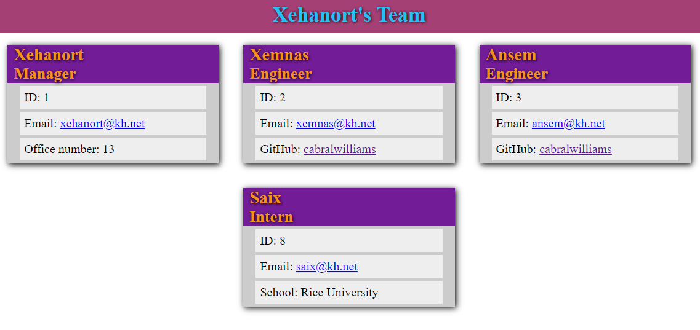

# Show My Team

  

  

  ## Description
  This project allows the user to input data to build an html view of her/his technology team.  Once completed, the user will have nicely styled view of the team and will be able to readily email or check out Github profiles of selected team members.
  
  ## Table of Contents
  
  * [Installation](#installation)
  * [Usage](#usage)
  * [License](#license)
  * [Contributing](#contributing)
  * [Tests](#tests)
  * [Questions](#questions)
  
  ## Installation
  
  The user should clone this repository and then make sure that the node packages inquirer and jest are installed.  Jest should be installed as a dev dependency.
  
  ## Usage
  
  Once the project files are successfully cloned and the aforementioned node packages are correctly installed, the user needs to run the command 'node index.js' or 'node index' from the root directory.  Following this, the user needs to answer the questions that are prompted.
  
  ## License
  
  The content of this project is licensed under [The Unlicense](http://unlicense.org/).  Please click [here](http://unlicense.org/) for more information about how you may use code in this project.

  ## Contributing

  This particular project is more or less complete, but if anyone would like to contribute suggestions, please feel free to contact me with any of the methods that follow in this file.
  
  
  ## Tests
  
  This project utilized the jest package in building and validating the object's used.  If you wish to test the objects, use the command 'npm run test' at the root menu to see the tests that were passed.
  
  ## Questions
  [GitHub Profile](http://github.com/cabralwilliams)
  
  For any questions concerning this application, please contact me at cabral.williams@gmail.com.